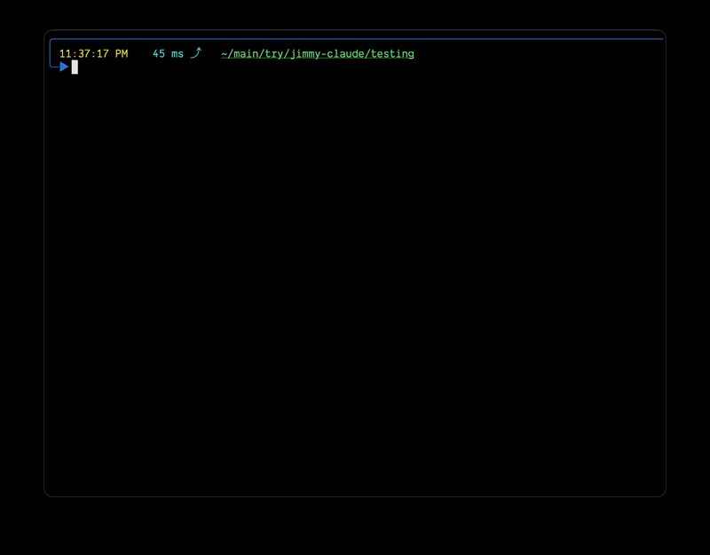

# jimmy-claude

A tiny Anthropic-compatible shim that puts the [ChatJimmy](https://chatjimmy.ai)
hardware-LLM API behind the `/v1/messages` surface that Claude Code speaks — so
you can point the harness at Jimmy and feel ~14k tokens/sec decode.

Python 3 standard library only. Nothing to install.

## Demo



## Run

```sh
python3 jimmy_proxy.py
```

It listens on `http://127.0.0.1:8787` and prints the exact `claude` command to use.

## Point Claude Code at it

In another terminal:

```sh
ANTHROPIC_BASE_URL=http://127.0.0.1:8787 \
ANTHROPIC_API_KEY=dummy \
ANTHROPIC_MODEL=llama3.1-8B \
ANTHROPIC_SMALL_FAST_MODEL=llama3.1-8B \
claude --bare --strict-mcp-config --disable-slash-commands
```

(`ANTHROPIC_API_KEY` is ignored by the proxy but Claude Code wants one set.)

### Strip the context (recommended for the 8B)

The small model does much better with less to wade through. Two flags help a lot:

- `--bare` — skips hooks, LSP, plugin sync, auto-memory, CLAUDE.md
  auto-discovery, and keychain reads; forces `ANTHROPIC_API_KEY` auth (exactly
  what we want with the proxy).
- `--strict-mcp-config` — with no `--mcp-config`, loads **no** MCP servers,
  dropping the ~50 chrome-devtools/playwright tools.
- Add `--disable-slash-commands` to also disable skills.

Measured effect on the request the harness sends: **79 tools → 3, ~3275 → ~749
input tokens.** (The proxy already caps the catalog it shows the model to 10, so
the win is faster prefill, fewer wrong-tool options, and no hooks firing.)

## Agent mode (tool use)

Jimmy serves `llama3.1-8B`, which has no native Anthropic tool-calling. "Agent
mode" (on by default) papers over that so the harness is actually usable:

- It **replaces** Claude Code's huge system prompt with a tight, tailored one and
  a compact catalog built from the *real* tools in each request (core tools like
  Bash/Read/Write/Edit first), plus a few-shot example, teaching the model to
  emit tool calls as a single line of JSON:
  `{"tool_call": {"name": "...", "input": {...}}}`
- It **parses that back** into real Anthropic `tool_use` streaming events, so the
  harness runs the tool and feeds the result in — closing the loop. The parser
  tolerates leading labels, code fences, `<|python_tag|>`, and even truncated
  JSON (it repairs unbalanced braces).
- It enforces **stop sequences** client-side (`\nUser:`, `\nAssistant:`, …) so the
  small model can't role-play the whole conversation and spin out.
- Plain prose answers still **stream live**, so you keep the speed feel.

### What to expect

It genuinely completes simple tool-using tasks (e.g. "run `cat file` and report
it" — it picks Bash, runs it, reports back, and stops). But it's still an 8B
model: on anything non-trivial it will pick wrong tools, invent arguments, or
**confabulate** (read a file correctly, then make up extra content in its
summary). Treat it as a fast, fun, unreliable demo — not a coding agent you'd
trust with real edits. The fidelity ceiling is the model, not the proxy.

Set `JIMMY_AGENT_MODE=0` for a raw text passthrough (no tool translation).

## How it translates

| Anthropic                              | Jimmy                                   |
| -------------------------------------- | --------------------------------------- |
| `system` (string or blocks)            | `chatOptions.systemPrompt`              |
| `messages[].content` (string or blocks)| flattened to text per message           |
| `model`                                | `chatOptions.selectedModel` (or default)|
| streamed text deltas                   | Jimmy's raw text stream                 |
| `<\|stats\|>{...}<\|/stats\|>` trailer | stripped; token counts feed `usage`     |

The proxy re-emits Jimmy's stream as Anthropic SSE events (`message_start` →
`content_block_delta` → `message_delta` → `message_stop`) using HTTP/1.1 chunked
framing. It also answers `POST /v1/messages/count_tokens` with a char/4 estimate.

## Config (env vars)

| Var                      | Default                          | Purpose                                        |
| ------------------------ | -------------------------------- | ---------------------------------------------- |
| `JIMMY_PROXY_HOST`       | `127.0.0.1`                      | bind host                                      |
| `JIMMY_PROXY_PORT`       | `8787`                           | bind port                                      |
| `JIMMY_URL`              | `https://chatjimmy.ai/api/chat`  | upstream endpoint                              |
| `JIMMY_MODEL`            | `llama3.1-8B`                    | model to request from Jimmy                    |
| `JIMMY_TOPK`             | `8`                              | Jimmy `topK`                                   |
| `JIMMY_AGENT_MODE`       | `1`                              | teach + translate tool calls (0 = raw text)    |
| `JIMMY_MAX_TOOLS`        | `10`                             | tools shown to the model, core first (0 = all) |
| `JIMMY_MAX_INPUT_CHARS`  | `14000`                          | trim oldest turns past this budget (0 = off)   |
| `JIMMY_MAX_TOOL_RESULT_CHARS` | `4000`                      | truncate each tool result fed back             |
| `JIMMY_SYSTEM_OVERRIDE`  | _unset_                          | replace the system prompt entirely             |

Notes:
- A small model wanders when shown many tools, so `JIMMY_MAX_TOOLS` caps the
  catalog (the 2-tool case is near-perfect; 15+ tools causes random picks).
- Jimmy's context is small, so the proxy trims oldest messages under
  `JIMMY_MAX_INPUT_CHARS`. If Jimmy errors on long inputs, lower it.

## Disclaimer

Unofficial and unaffiliated — this is a hobby shim, not endorsed by ChatJimmy or
Anthropic. It calls the public `chatjimmy.ai` endpoint; be respectful of their
service and don't use it for anything you wouldn't run by hand in their web UI.
"Claude" and "Anthropic" are trademarks of Anthropic; "Jimmy"/"ChatJimmy"
belong to their respective owners.

## License

[MIT](./LICENSE)
